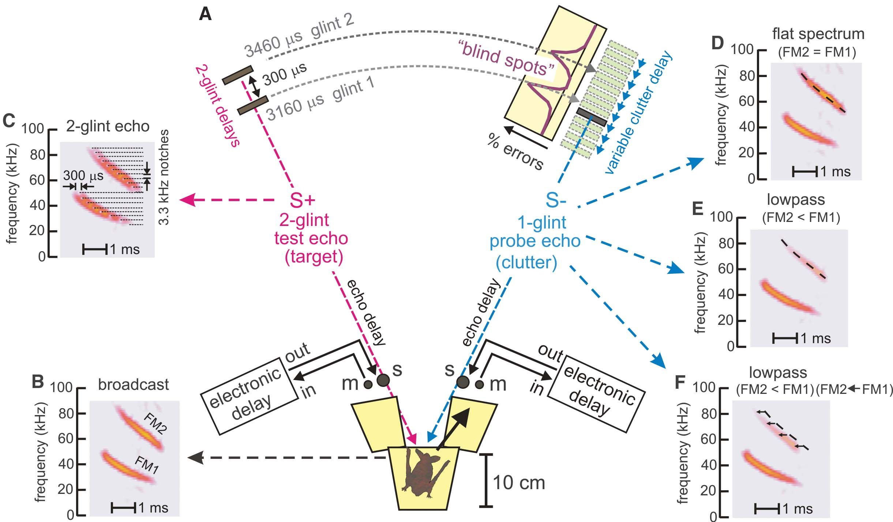
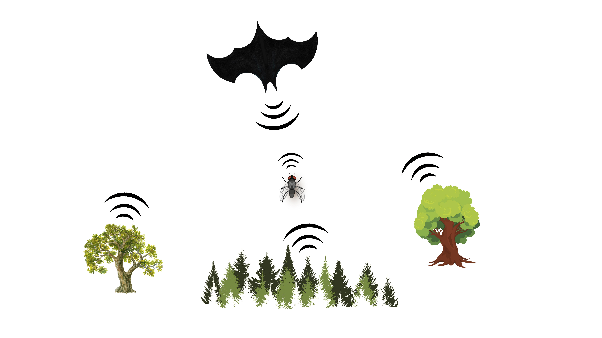
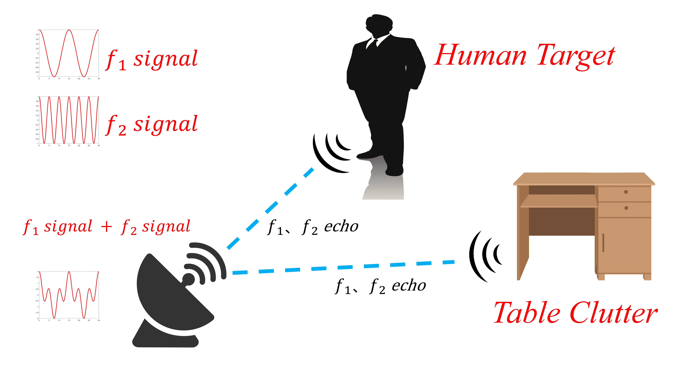

# MIMICKING BATS' ECHOLOCATION: A BIOMIMETIC APPROACH FOR INDOOR HUMAN TARGET DETECTION

**Junkai Hou, Chunpeng Lu, Hanbin Guo, Yuan He***

## About Bats
### How Do Bats Distinguish Prey Target and Clutter?

- **By emitting signals of two different frequencies**
- **By comparing the power ratio of the two frequencies of echo signals from each target**

### The Similarity between Bats and Radar

**The ability of bats to effectively distinguish targets from clutter in a complicated natural environment is quite similar to that of radar detection in a complex indoor environment!**

## Equation Deduction
According to the radar equation, the echo power of a single-frequency signal $P_r$ can be expressed as
$$P_r = \frac{P_tG_tG_r\lambda^2\sigma_{RCS}}{(4\pi)^3R^4}$$
RCS is exceedingly complex because of all these elements, so we mainly take frequency, conductivity and relative dielectric constant into account while assuming $G_t = G_r = G$, it can be rewritten as
$$
P_r\left( f_i,\varepsilon _r,\sigma _{cond} \right) =\frac{P_tG^2\lambda _{i}^{2}\sigma _{RCS}\left( f_i,\varepsilon _r,\sigma _{cond} \right)}{\left( 4\pi \right) ^3R^4}
$$
Mimicking bats distinguish targets by comparing the power ratio of the two frequencies of echo signals, for a single target, its echo power ratio $P_{ratio}(\varepsilon_r)$ can be expressed as
$$
P_{ratio}\left( \varepsilon _r \right) =\frac{P_r\left( f_2,\varepsilon _r,\sigma _{cond} \right)}{P_r\left( f_1,\varepsilon _r,\sigma _{cond} \right)}=\frac{\lambda _{2}^{2}\sigma _{RCS}\left( f_2,\varepsilon _r,\sigma _{cond} \right)}{\lambda _{1}^{2}\sigma _{RCS}\left( f_1,\varepsilon _r,\sigma _{cond} \right)}
$$
considering
$$
\lambda     = \frac{c}{f}
$$
So
$$
P_{ratio}\left( \varepsilon _r \right) =\frac{P_r\left( f_2,\varepsilon _r,\sigma _{cond} \right)}{P_r\left( f_1,\varepsilon _r,\sigma _{cond} \right)}=\frac{f_{1}^{2}\sigma _{RCS}\left( f_2,\varepsilon _r,\sigma _{cond} \right)}{f_{2}^{2}\sigma _{RCS}\left( f_1,\varepsilon _r,\sigma _{cond} \right)}
$$

## Simulations and Results
### 1. Simulation of Single-human Target

.svg)

.svg)

.svg)
### 2. Simulation of Multi-human Target

.svg)

### 3. Intrinsic Power Ratio
- Human: 4.46~4.57
- Table Clutter: 2.54~2.74