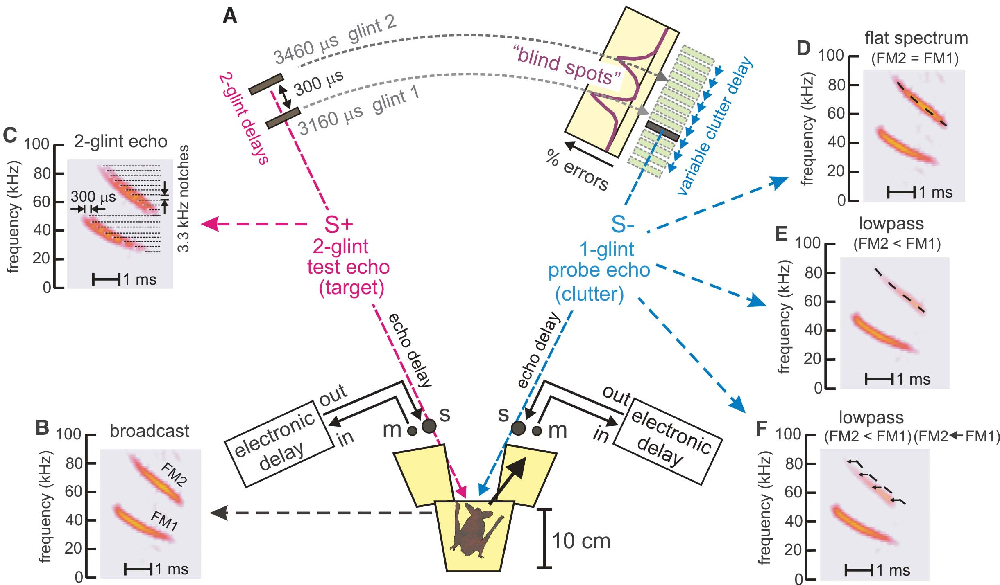
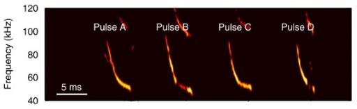
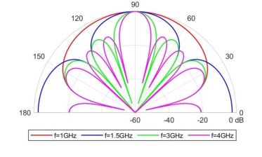
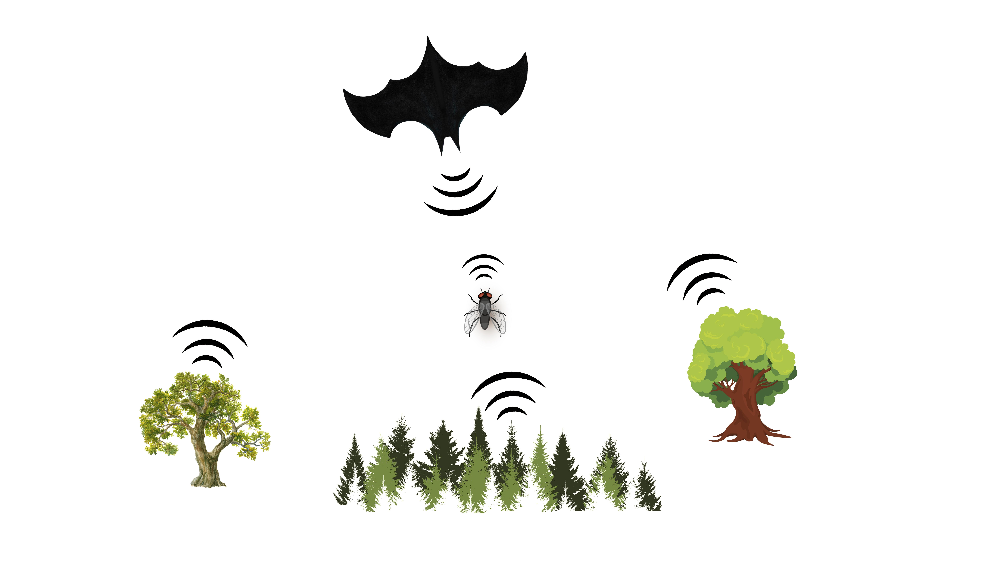
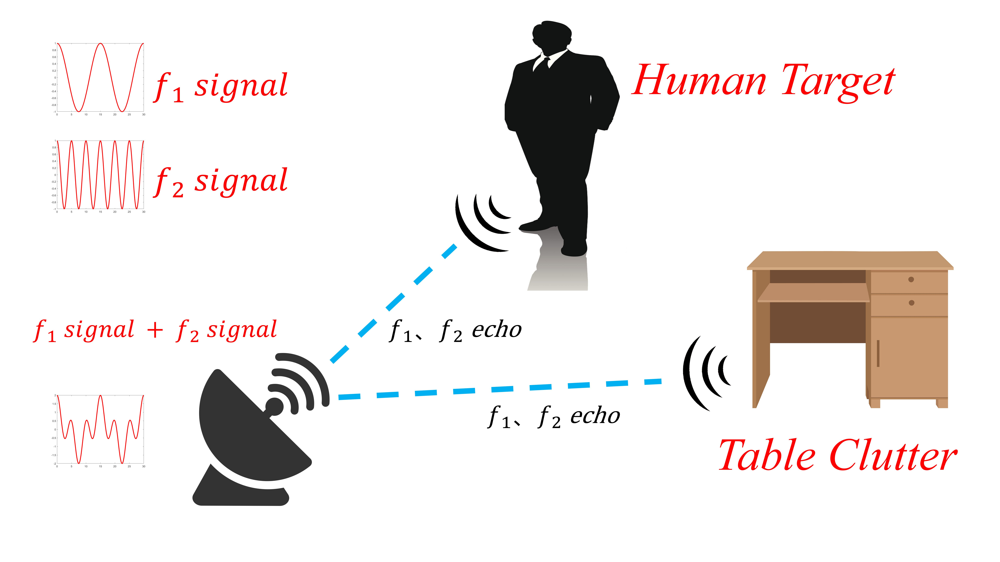

# [Accepted by IET Internatioinal Radar Conference 2025]MIMICKING BATS' ECHOLOCATION: A BIOMIMETIC APPROACH FOR INDOOR HUMAN TARGET DETECTION

**Junkai Hou, Chunpeng Lu, Hanbin Guo, Yuan He***

[Paper](Paper_Junkai_Hou.pdf)
[Poster](IET_Poster.pdf)
## About Bats
### How Do Bats Distinguish Prey Target and Clutter?

- **By emitting signals of two different frequencies**
- **By comparing the power ratio of the two frequencies of echo signals from each target**
### How Do Bats Make Sounds?

At a certain moment, bat sonar **simultaneously emits multi-frequency point signals with a certain frequency difference**. Over time, a specific **multi-band nonlinear frequency-modulated** signal is formed.

### About Antenna Gain

The transmission and reception of multi-band signals require corresponding **radar antenna arrays** to be achieved. For different frequency components of multi-band signals, the main lobe width, side lobe amplitude, and beam dynamic scanning of the antenna beam all impose different requirements on the beamforming of the antenna array.
### The Similarity between Bats and Radar

**The ability of bats to effectively distinguish targets from clutter in a complicated natural environment is quite similar to that of radar detection in a complex indoor environment!**

## Equation Deduction
According to the radar equation, 
the echo power of a single-frequency signal $P_r$ can be expressed as  

$$P_r = \frac{P_tG_tG_r\lambda^2\sigma_{RCS}}{(4\pi)^3R^4}$$

RCS is exceedingly complex because of all these elements, so we mainly take frequency, conductivity and relative dielectric constant into account while assuming $G_t = G_r = G$, it can be rewritten as  

$$P_r( f_i,\varepsilon _r,\sigma _{cond}) =\frac{P_tG^2\lambda _{i}^{2}\sigma _{RCS}( f_i,\varepsilon _r,\sigma _{cond} )}{( 4\pi ) ^3R^4}$$
Mimicking bats distinguish targets by comparing the power ratio of the two frequencies of echo signals, for a single target, its echo power ratio $P_{ratio}(\varepsilon_r)$ can be expressed as
$$P_{ratio}( \varepsilon _r ) =\frac{P_r( f_2,\varepsilon _r,\sigma _{cond} )}{P_r( f_1,\varepsilon _r,\sigma _{cond} )}=\frac{\lambda _{2}^{2}\sigma _{RCS}( f_2,\varepsilon _r,\sigma _{cond} )}{\lambda _{1}^{2}\sigma _{RCS}( f_1,\varepsilon _r,\sigma _{cond} )}$$
considering
$$\lambda     = \frac{c}{f}$$
So
$$P_{ratio}( \varepsilon _r ) =\frac{P_r( f_2,\varepsilon _r,\sigma _{cond} )}{P_r( f_1,\varepsilon _r,\sigma _{cond} )}=\frac{f_{1}^{2}\sigma _{RCS}( f_2,\varepsilon _r,\sigma _{cond} )}{f_{2}^{2}\sigma _{RCS}( f_1,\varepsilon _r,\sigma _{cond} )}$$

## Intrinsic Power Ratio

- **Human: 4.46~4.57**
- **Table Clutter: 2.54~2.74**

**Successfully Distinguished!**